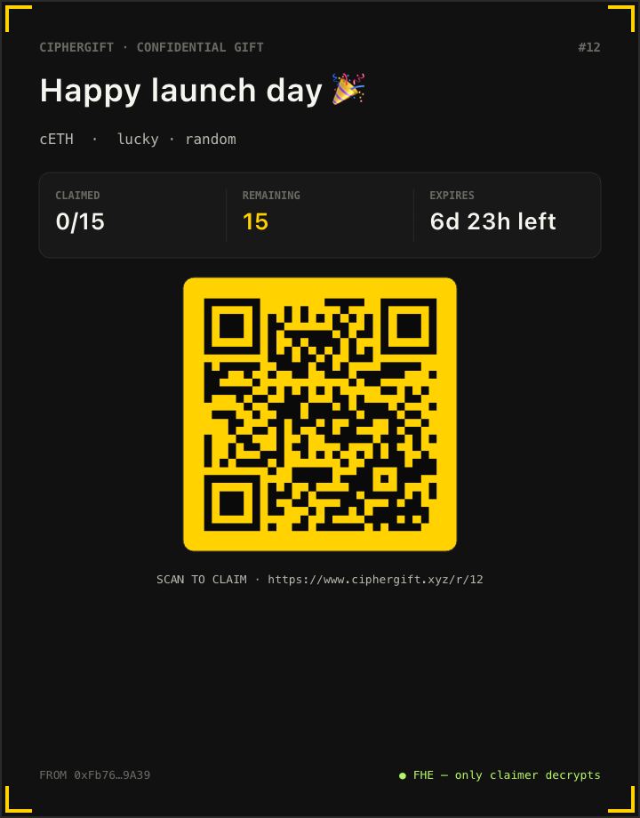

<div align="center">

<br/>


<br/><br/>

# Confidential Gift Packets on Zama FHEVM

### *Red envelopes, airdrops, and team payouts where amounts are mathematically private — not just policy-private.*

<br/>

[](https://www.ciphergift.xyz)
[](https://youtu.be/RghDukEKUJ0)

[](https://www.zama.ai/)
[](https://www.zama.ai/)
[](https://docs.zama.ai/fhevm)
[]()
[]()
[]()

<br/>

[English](./README.md) · [中文](./docs/README_zh.md)

<br/>

---

<table width="100%">
<tr>
<td width="100%" valign="top" align="center">

**🚀 &nbsp;Try it now**

[Live Demo on Sepolia](https://www.ciphergift.xyz) &nbsp;·&nbsp; [Watch Demo on YouTube](https://youtu.be/RghDukEKUJ0) &nbsp;·&nbsp; [Claim the launch gift](https://www.ciphergift.xyz/r/12)

</td>
</tr>
<tr>
<td width="100%" valign="top" align="center">

**📖 &nbsp;Understand the project**

[Overview](#-overview) &nbsp;·&nbsp; [Why CipherGift](#-why-ciphergift) &nbsp;·&nbsp; [Packet Types](#-packet-types) &nbsp;·&nbsp; [Participants](#-participants--entities) &nbsp;·&nbsp; [Architecture](#-architecture) &nbsp;·&nbsp; [Smart Contracts](#-smart-contracts) &nbsp;·&nbsp; [FHE ACL Chain](#-fhe-acl-chain) &nbsp;·&nbsp; [Design Decisions](#-notable-design-decisions)

</td>
</tr>
<tr>
<td width="100%" valign="top" align="center">

**🛠️ &nbsp;Build and deploy**

[Prerequisites](#-prerequisites) &nbsp;·&nbsp; [Local Deployment](#-local-deployment) &nbsp;·&nbsp; [Sepolia Deployment](#-sepolia-deployment) &nbsp;·&nbsp; [Routes](#-routes) &nbsp;·&nbsp; [Tech Stack](#-tech-stack)

</td>
</tr>
</table>

---

</div>

<br/>

## 🎬 Live Demo

<div align="center">
<table>
<tr>
<td align="center" width="50%">

### 🌐 Try it Live

[](https://www.ciphergift.xyz)

Runs against **Sepolia testnet**<br/>
Connect MetaMask or any RainbowKit<br/>
wallet to send and claim packets.

</td>
<td align="center" width="50%">

### 🎥 Watch the Demo

[](https://youtu.be/RghDukEKUJ0)

Full **end-to-end walkthrough** —<br/>
wrap, send, claim, decrypt,<br/>
refund, and unwrap.

</td>
</tr>
</table>
</div>

<br/>

## 🎉 Launch Gift Packet

<div align="center">

A confidential CipherGift is live right now. Scan or click the card to claim — only your wallet can decrypt your share.

<a href="https://www.ciphergift.xyz/r/12">
  
</a>

[**ciphergift.xyz/r/12 →**](https://www.ciphergift.xyz/r/12)

</div>

<br/>

## 🚀 Deployments

### Sepolia &nbsp;·&nbsp; chainId `11155111`

| Contract | Address |
|---|---|
| `CipherGift` | [`0x1BFE706fC87B8C4Fef962b1a275586769FAD746E`](https://sepolia.etherscan.io/address/0x1BFE706fC87B8C4Fef962b1a275586769FAD746E) |
| `ConfidentialETHVault` | [`0x01B008Ed2fA95858D9bfB730F58B5a49fA77b588`](https://sepolia.etherscan.io/address/0x01B008Ed2fA95858D9bfB730F58B5a49fA77b588) |
| `ConfidentialERC20Vault` (cUSDC) | *not deployed yet* |
| `ConfidentialERC20Vault` (cZAMA) | *not deployed yet* |

> Auto-generated address bindings (used by the frontend) live in [`packages/site/contracts/`](./packages/site/contracts/). Local-chain (`chainId 31337`) deployments live in the gitignored `*.local.ts` siblings.

<br/>

## 🔍 Overview

**CipherGift** is a confidential gift-packet protocol for sending crypto to one person, a group, or an entire allowlist — without leaking how much each recipient received. Built on **Zama's fhEVM** (Fully Homomorphic Encryption Virtual Machine), it guarantees that **per-share amounts and per-claimer records are mathematically unreadable** on-chain.

This is fundamentally different from how crypto gifts, airdrops, and red-envelope dApps work today. When you split tokens with Disperse, run a Merkle airdrop with the standard distributor, or send a red envelope on any L1/L2, every claim broadcasts the exact amount in plaintext. Anyone with a block explorer can rebuild the entire distribution: who got the most, who got the least, and the full curve.

**CipherGift closes that gap entirely.** Per-share amounts live as FHE-encrypted `euint64` handles, vault balances are encrypted, and claim records expose only the fact that a claim happened — never the amount. Only the intended claimer can decrypt their own share, via a per-recipient FHE ACL grant.

<br/>

## ⚡ Why CipherGift

<table>
<thead>
<tr>
<th>Feature</th>
<th>Traditional Crypto Gifts / Airdrops</th>
<th><strong>CipherGift</strong></th>
</tr>
</thead>
<tbody>
<tr>
<td>Per-share amount on-chain</td>
<td>❌ Public plaintext on Etherscan</td>
<td>✅ FHE-encrypted, only claimer decrypts</td>
</tr>
<tr>
<td>Sender's vault balance</td>
<td>❌ Public ERC-20 balance</td>
<td>✅ FHE-encrypted, owner-only decrypt</td>
</tr>
<tr>
<td>Allowlist for targeted drops</td>
<td>❌ Public Merkle leaves leak addresses</td>
<td>✅ Merkle root only · per-invitee salt off-chain</td>
</tr>
<tr>
<td>Random / lucky-draw splits</td>
<td>⚠️ Pseudo-random off-chain, then plaintext on-chain</td>
<td>✅ On-chain `FHE.randEuint64`, encrypted residual via `FHE.select`</td>
</tr>
<tr>
<td>Password-gated claim</td>
<td>❌ Reveals secret in calldata</td>
<td>✅ Stored as `keccak256(packetId, keccak(password))`</td>
</tr>
<tr>
<td>Refund of unclaimed funds</td>
<td>⚠️ Manual or trapped</td>
<td>✅ Encrypted residual returned to creator's vault</td>
</tr>
<tr>
<td>Multi-asset support</td>
<td>⚠️ Per-asset deployments</td>
<td>✅ ETH + ERC-20 vaults share one packet contract</td>
</tr>
</tbody>
</table>

> **One-liner:** *Etherscan-proof gifts.* Anyone who has ever sent a token on a transparent chain and watched the recipients compare numbers in the group chat will immediately understand the value.

<br/>

## 🎁 Packet Types

CipherGift ships with **four packet primitives**, all encrypted end-to-end. Each addresses a different distribution intent.

<table>
<thead>
<tr>
<th>Type</th>
<th>Distribution</th>
<th>Privacy property</th>
<th>Use case</th>
</tr>
</thead>
<tbody>
<tr>
<td><strong>EQUAL</strong></td>
<td>Every claimer receives <code>total / shares</code> exactly</td>
<td>Per-share amount encrypted, but predictable from total + shares (sender chooses what to reveal)</td>
<td>Fair team payouts, fixed bonuses</td>
</tr>
<tr>
<td><strong>RANDOM</strong></td>
<td>Each share drawn under FHE via <code>FHE.randEuint64()</code>, capped at a sender-chosen scalar bound. Last claimer takes the encrypted residual via <code>FHE.select</code></td>
<td>Each individual share fully encrypted, only the upper bound is public</td>
<td>Lucky-draw red envelopes, viral giveaways</td>
</tr>
<tr>
<td><strong>TARGETED</strong></td>
<td>Equal split, but only addresses on a Merkle allowlist can claim</td>
<td>Chain stores only the root; invitee list lives off-chain via per-recipient salt + proof</td>
<td>Confidential team distribution, private allowlist airdrops</td>
</tr>
<tr>
<td><strong>PASSWORD</strong></td>
<td>Equal split, gated by a shared secret phrase</td>
<td>Contract stores <code>keccak256(packetId, keccak(password))</code>; password never appears on-chain</td>
<td>Casual link-forwarding, conference giveaways</td>
</tr>
</tbody>
</table>

All four types support **expiry + creator refund** of the unclaimed encrypted residual. Packets can be backed by **cETH** by default, or by any registered ERC-20 vault (e.g. **cUSDC** / **cZAMA**).

<br/>

## 👥 Participants & Entities

CipherGift is fully permissionless — there is no employer registry, no per-user onboarding. Three roles emerge naturally from the contract design.

<br/>

### 🏗️ Platform Admin

> The deployer and owner of the shared protocol contracts.

The Platform Admin is responsible for:

- Deploying `ConfidentialETHVault` and `CipherGift` (one instance per network)
- Optionally deploying and registering `ConfidentialERC20Vault` instances (cUSDC, cZAMA, etc.) by calling `CipherGift.registerAsset(vaultAddress)`
- Holding the owner key, which gates **only**: emergency `pause()` (blocks new packet creation), `unpause()`, and `transferOwnership()` (two-step)

In production, this role is intended to be held by a multisig. The deploy script supports staged ownership transfer via `MULTISIG_OWNER` — the EOA remains owner until the multisig calls `acceptOwnership()`, so a typoed address won't brick the contract.

The Platform Admin **never** touches user funds, allowlists, or claim flows.

<br/>

### 🎁 Sender

> Anyone who wants to distribute encrypted value to one or many recipients.

**On-chain actions:**
1. Calls `vault.depositETH()` (or `vault.deposit(amount)` for an ERC-20 vault) to wrap plaintext into encrypted vault units
2. Calls `CipherGift.createPacket(...)` or `createPacketWithAsset(assetId, ...)` with an FHE-encrypted total and the chosen packet type
3. Optionally generates a Merkle root + per-invitee salts (TARGETED) or hashes a password (PASSWORD) client-side
4. Shares the resulting `/r/[id]` link, the per-invitee salt link, or the password out-of-band
5. Calls `closeAndRefund(id)` after expiry to reclaim the encrypted residual

**What the Sender can decrypt:**
- Their own vault balance
- The total amount they originally encrypted (they encrypted it)
- The remaining balance of each packet they created (FHE ACL grant)
- **Not** any individual claimer's share — even the creator cannot see who got what

<br/>

### 🙋 Claimer

> Anyone who holds a valid claim path: a public link (RANDOM/EQUAL), a Merkle proof (TARGETED), or the password (PASSWORD).

**On-chain actions:**
1. Visits the share link, which auto-opens the claim modal at `/r/[id]`
2. Calls `claim(id)`, `claimTargeted(id, salt, proof)`, or `claimWithPassword(id, password)`
3. Decrypts their own share in the browser via `userDecrypt` / `signUserDecrypt`
4. Optionally calls `vault.requestWithdraw(...)` → `fulfillWithdraw(...)` to convert encrypted balance back into plaintext ETH/ERC-20

**What the Claimer can decrypt:**
- Only their own share for any packet they claimed (FHE ACL is scoped strictly to `msg.sender` at claim time)
- Their own confidential vault balance
- **Not** other claimers' shares, **not** the remaining balance, **not** other packets' totals

<br/>

## 🏛️ Architecture

```
┌─────────────────────────────────────────────────────────────────┐
│                       CipherGift PROTOCOL                       │
│                                                                 │
│  ┌────────────────────────────────────────────────────────┐     │
│  │                    BLOCKCHAIN LAYER                    │     │
│  │                  (Ethereum / Sepolia)                  │     │
│  │                                                        │     │
│  │  ┌──────────────────────────────────────────────────┐  │     │
│  │  │  ConfidentialETHVault   (deployed by Admin)      │  │     │
│  │  │  Encrypted ETH balance (euint64, gwei units)     │  │     │
│  │  └──────────────────────────────────────────────────┘  │     │
│  │  ┌──────────────────────────────────────────────────┐  │     │
│  │  │  ConfidentialERC20Vault [cUSDC, cZAMA, …]        │  │     │
│  │  │  Encrypted ERC-20 balance · gateway withdrawals  │  │     │
│  │  └──────────────────────────────────────────────────┘  │     │
│  │                           │                            │     │
│  │  ┌──────────────────────────────────────────────────┐  │     │
│  │  │  CipherGift   (deployed by Admin)                │  │     │
│  │  │  Packet logic on top of any IConfidentialVault   │  │     │
│  │  │  EQUAL · RANDOM · TARGETED · PASSWORD            │  │     │
│  │  │  euint64 totals · per-claimer FHE ACL · refund   │  │     │
│  │  └──────────────────────────────────────────────────┘  │     │
│  └────────────────────────────────────────────────────────┘     │
│                                                                 │
│  ┌────────────────────────────────────────────────────────┐     │
│  │              INDEXING LAYER (optional)                 │     │
│  │                                                        │     │
│  │  packages/indexer  · viem poller + Hono HTTP API       │     │
│  │  packages/subgraph · The Graph subgraph alternative    │     │
│  │                                                        │     │
│  │  Frontend prefers subgraph → REST indexer → chain      │     │
│  └────────────────────────────────────────────────────────┘     │
│                                                                 │
│  ┌────────────────────────────────────────────────────────┐     │
│  │          FRONTEND  (Next.js 15 / packages/site)        │     │
│  │                                                        │     │
│  │  /            Connect screen · RainbowKit              │     │
│  │  /dashboard   Vault balance · sent / claimable summary │     │
│  │  /send        SendWizard · 4 packet types · SigningModal│    │
│  │  /inbox       Claimable packets · OpenModal · DecryptLog│    │
│  │  /sent[/id]   Creator view · share link · refund        │    │
│  │  /vault       Deposit · decrypt · two-phase withdraw    │    │
│  │  /r/[id]      Public share-link landing                 │    │
│  │                                                        │     │
│  │  wagmi · RainbowKit · @zama-fhe/react-sdk              │     │
│  └────────────────────────────────────────────────────────┘     │
└─────────────────────────────────────────────────────────────────┘
```

<br/>

## 📜 Smart Contracts

Four contracts form the on-chain protocol. The Platform Admin deploys them once per network; users interact directly without any registration step.

<br/>

### `IConfidentialVault`

> **Interface · asset-agnostic abstraction**

The interface `CipherGift` calls. Any vault that exposes encrypted internal accounting can plug in.

| Function | Description |
|---|---|
| `internalCredit(to, amountEnc)` | Orchestrator-only · credit encrypted units |
| `internalDebit(from, amountEnc)` | Orchestrator-only · debit encrypted units |
| `internalTransfer(from, to, amountEnc)` | Orchestrator-only · move encrypted units |
| `balanceOf(user) → euint64` | Encrypted balance handle |

Asset decimals, deposit/withdraw plumbing, and gateway logic stay inside each vault — `CipherGift` never sees them.

<br/>

### `ConfidentialETHVault`

> **Deployed by:** Platform Admin · **Backs cETH packets**

Holds pooled ETH and tracks each user's holdings as `mapping(address => euint64)` in **gwei units** (1 ETH = 1e9 vault units, fits cleanly in `euint64`).

| Function | Caller | Description |
|---|---|---|
| `depositETH() payable` | Anyone | Wraps ETH into encrypted balance |
| `requestWithdraw(encryptedAmount, proof)` | User | Snapshot encrypted balance for KMS gateway decryption |
| `fulfillWithdraw(...)` | KMS callback | Verify proof and release plaintext ETH |
| `internalCredit / internalDebit / internalTransfer` | `CipherGift` only | Encrypted internal movement |
| `balanceOf(user)` | Anyone (returns ciphertext) | Encrypted balance handle |

While a withdrawal is pending, debit paths are blocked so the fulfilled cleartext can never exceed the current encrypted balance.

<br/>

### `ConfidentialERC20Vault`

> **Deployed by:** Platform Admin (per-asset) · **Backs cUSDC / cZAMA / arbitrary ERC-20 packets**

Mirrors the ETH vault for ERC-20 assets. `deposit(tokenAmount)` pulls approved tokens with `transferFrom`, converts to vault units (`unitDecimals = 6` for cUSDC/cZAMA), and stores the balance encrypted. Withdrawals follow the same KMS-gateway request/fulfill pattern.

<br/>

### `CipherGift`

> **Deployed by:** Platform Admin · **Core packet logic**

The packet contract. Sits on top of any `IConfidentialVault` and orchestrates create / claim / refund.

| Function | Caller | Description |
|---|---|---|
| `createPacket(...)` | Sender | Default cETH packet — EQUAL / RANDOM / TARGETED / PASSWORD |
| `createPacketWithAsset(assetId, ...)` | Sender | Bind packet to a registered ERC-20 vault |
| `claim(id)` | Claimer | Open RANDOM / EQUAL packet · FHE-randomised share |
| `claimTargeted(id, salt, proof)` | Claimer | Merkle-gated TARGETED packet |
| `claimWithPassword(id, password)` | Claimer | Hash-gated PASSWORD packet |
| `closeAndRefund(id)` | Creator | After expiry, return encrypted residual to creator's vault |
| `registerAsset(vault)` / `unregisterAsset(vault)` | Owner | Whitelist ERC-20 vaults |
| `pause()` / `unpause()` | Owner | Emergency: block new packet creation only |

**Key design decisions:**
- The per-claim share ciphertext is stored in `mapping(uint256 => mapping(address => euint64)) claimedAmount` with `FHE.allow(share, claimer)` — only the recipient can ever decrypt
- `pause()` blocks `_createPacket` only — `claim`, `claimTargeted`, `claimWithPassword`, and `closeAndRefund` are always available so funds can never be trapped
- TARGETED packets store **only** the Merkle root — invitee list never touches the chain

<br/>

## 🔐 FHE ACL Chain

Every encrypted-mutation site re-allows the new ciphertext to the parties that need to read it.

| Op | `FHE.allowThis` | `FHE.allow(_, claimer)` | `FHE.allow(_, vault)` |
|---|---|---|---|
| `createPacket → totalEnc` | ✓ | — | ✓ |
| `createPacket → equalShareEnc` (EQUAL/TARGETED) | ✓ | — *(creator gets it explicitly)* | ✓ |
| `claim → share` | ✓ | ✓ | ✓ *(must re-allow even for EQUAL — RANDOM produces a fresh `FHE.select` ciphertext)* |
| `claim → updated remainingAmount` | ✓ | *(creator)* | ✓ |

> **Why re-allow on EQUAL too?** `FHE.allow` is idempotent for the literal handle, but the RANDOM path produces a fresh ciphertext via `FHE.select`. Treating both branches uniformly keeps the permission flow auditable and removes a class of "share is set but not allowed" bugs.

<br/>

## 🎲 Random Share Algorithm

```solidity
if (isLastClaimer) {
    share = remainingAmount;          // takes the encrypted residual
} else {
    randomVal  = FHE.randEuint64();
    capped     = FHE.rem(randomVal, maxShareScalar);   // scalar plaintext bound
    overshoot  = FHE.lt(remainingAmount, capped);
    share      = FHE.select(overshoot, remainingAmount, capped);
}
```

`maxShareScalar` is plaintext (sender provides it; UI defaults to `2 × total / shares`). This reveals the **upper bound** on per-share size but keeps each individual share encrypted within it. The full total is always distributed because the last claimer takes whatever's left.

> **Why a plaintext scalar?** `FHE.rem` only accepts a scalar (plaintext) divisor in `fhevm-solidity 0.11`. An encrypted-divisor `rem` would require a much more expensive library. Surfacing the bound explicitly to the sender makes the trade-off visible in the UX.

<br/>

## 🔀 On-chain / Off-chain Design

CipherGift puts **everything sensitive on-chain under FHE**, and pushes only invitee allowlists off-chain — for the simple reason that there is nothing to enumerate.

<br/>

### What lives on-chain (encrypted)

| Data | Type | Why FHE |
|---|---|---|
| Total amount | `euint64` | Must be on-chain for trustless distribution; FHE prevents leak via `msg.value` |
| Per-share amount | `euint64` | RANDOM draws happen on-chain; EQUAL splits computed under FHE |
| Per-claimer share | `euint64` | Claim records prove eligibility without revealing amount |
| Vault balances (creator + claimer) | `euint64` | Internal movements `creator → packet → claimer` stay confidential |
| Remaining balance per packet | `euint64` | Updates on every claim; refund uses encrypted residual |

<br/>

### What lives on-chain (plaintext, by design)

| Data | Why public |
|---|---|
| Creator address | Required to gate `closeAndRefund` |
| Expiry timestamp | Public time bound — no FHE benefit |
| Share count | Coordination metadata, not value |
| Note (optional, sender-set) | UX label — sender controls disclosure |
| Asset ID (vault address) | Routing — packet has to know which vault to credit |
| Merkle root (TARGETED) | Verification needs the root; salts stay off-chain |
| Password hash (PASSWORD) | `keccak256(packetId, keccak(password))` — domain-separated to prevent cross-packet replay |

<br/>

### What lives off-chain

| Data | Distribution channel | Why off-chain |
|---|---|---|
| TARGETED invitee salt + proof | Per-invitee share link (`/r/[id]?s=…`) | Avoids broadcasting the invitee set on-chain |
| PASSWORD secret | Out-of-band (sender's choice) | High-entropy secret should never be on-chain |
| Packet `note` (when sensitive) | Sender's choice — store off-chain & link | Notes are plaintext on-chain by default; sender owns the privacy decision |

<br/>

## 🛡️ Notable Design Decisions

1. **Why a vault wrapper instead of `msg.value` per packet?**
   A plaintext deposit / withdraw at the boundary is unavoidable, but keeping balances + packet flows inside an encrypted ledger lets the *internal* movement (creator → packet → claimer) stay confidential. Without the vault, the total amount would leak via `msg.value` at create time.

2. **Why `via_ir = true` in `foundry.toml`?**
   The `Packet` struct + multiple `FHE.allow` calls inside `createPacket` push the EVM stack past the legacy depth limit when ciphertext locals are 32-byte handles. `viaIR` resolves it cleanly.

3. **Why a plaintext `maxShareScalar` for RANDOM?**
   `FHE.rem` only accepts a scalar (plaintext) divisor in `fhevm-solidity 0.11`. The sender picks the bound explicitly so the trade-off is visible in the UX.

4. **Why Merkle salts instead of an on-chain allowlist mapping?**
   TARGETED packets store only a Merkle root of `keccak(salt, address)` leaves. Each invitee receives a private link containing their salt and proof. The invitee set stays off-chain while preserving cheap claim-time verification.

5. **Why use vault addresses as asset IDs?**
   `CipherGift` does not need token decimals, symbols, or transfer logic. Binding a packet to a registered vault address keeps the packet math asset-agnostic — ETH, cUSDC, and cZAMA share the same encrypted claim/refund code.

6. **Why password hash instead of encrypted password matching?**
   The contract stores `keccak256(abi.encode(packetId, keccak256(bytes(password))))`. This gates casual link forwarding, but **is not a replacement for high-entropy secrets** — weak passwords can still be brute-forced from public transaction data. The UI surfaces this trade-off.

7. **Why two-phase withdrawals?**
   Releasing real ETH/ERC-20 tokens requires plaintext, but user balances are encrypted. The vault snapshots the encrypted handle with `FHE.makePubliclyDecryptable`, then `fulfillWithdraw` verifies the KMS proof before transferring the clear amount. While a request is pending, debit paths are blocked.

<br/>

## 🔒 Security & Pause Policy

The system applies defense-in-depth at the contract layer.

| Layer | Controls |
|---|---|
| **Vault** | Orchestrator-only `internalCredit/Debit/Transfer` · two-phase withdrawal · debit lock while withdraw pending · per-user encrypted balance with strict ACL |
| **Packet** | `FHE.allow(share, claimer)` scoped to `msg.sender` at claim time · per-packet `claimedAmount` mapping prevents double claim · expiry check on refund · creator-only refund · pause guard on `_createPacket` |
| **Asset registry** | Owner-only `registerAsset` / `unregisterAsset` · packet's asset binding stored at create time, immutable after |
| **Ownership** | OpenZeppelin `Ownable2Step` — typoed multisig address can't brick the contract |

### Pause policy

`CipherGift.pause()` is an emergency control owned by the contract owner (typically a multisig). It blocks `_createPacket` only — claim and refund paths remain open. The intent is to stop *new* exposure without trapping existing funds.

| Function | Paused state |
|---|---|
| `createPacket`, `createPacketWithAsset` | ⛔ Blocked |
| `claim`, `claimTargeted`, `claimWithPassword` | ✅ Always available |
| `closeAndRefund` | ✅ Always available |
| Vault `depositETH` / `requestWithdraw` / `fulfillWithdraw` | ✅ Always available |

> ⚠️ This is **not a formal audit**. Smart contracts have not been independently audited. Do not deploy with significant value before a security audit is completed.

<br/>

## 🗂️ Repository Structure

```
ciphergift/
│
├── packages/
│   ├── foundry/                        # Solidity + Forge
│   │   ├── src/
│   │   │   ├── IConfidentialVault.sol         # encrypted-balance vault interface
│   │   │   ├── ConfidentialETHVault.sol       # encrypted ETH balance per user
│   │   │   ├── ConfidentialERC20Vault.sol     # encrypted ERC-20 balance per user
│   │   │   └── CipherGift.sol                 # packet logic on top of vaults
│   │   ├── script/DeployCipherGift.s.sol
│   │   └── test/{ConfidentialETHVault,ConfidentialERC20Vault,CipherGift}.t.sol
│   │
│   ├── site/                           # Next.js 15 App Router
│   │   ├── app/                        # routes (page-per-screen)
│   │   ├── components/
│   │   │   ├── chrome/                 # AppChrome, SideNav, Logo
│   │   │   ├── primitives/             # Btn, Cipher, Coin, Stat, …
│   │   │   ├── send/                   # SendWizard, SigningModal
│   │   │   └── inbox/                  # PacketCard, OpenModal, DecryptLog
│   │   ├── hooks/                      # FHE I/O (useEncryptUint, useUserBalance, useClaim, …)
│   │   ├── lib/                        # format, packet-types, share-link, allowlist, indexer
│   │   ├── contracts/                  # auto-generated TS ABI / address files
│   │   └── services/web3/              # wagmi config + signer
│   │
│   ├── indexer/                        # viem poller + Hono HTTP server
│   │   └── src/{index,poller,store,abi}.ts
│   │
│   └── subgraph/                       # The Graph subgraph (hosted alternative)
│
├── scripts/
│   ├── chain.sh                        # local FHEVM stack
│   ├── deploy-localhost.sh             # forge script + ABI codegen
│   ├── deploy-sepolia.sh
│   └── generateTsAbis.ts               # broadcast → packages/site/contracts/*.ts
│
└── docs/
    ├── README_zh.md                    # Chinese README
    └── images/                         # README assets
```

<br/>

## 🛠️ Prerequisites

| Tool | Version | Installation |
|---|---|---|
| **Node.js** | 20+ | [nodejs.org](https://nodejs.org/) |
| **pnpm** | 10+ | `npm i -g pnpm` |
| **Foundry** | latest | [getfoundry.sh](https://getfoundry.sh) |
| **MetaMask** *(or any RainbowKit wallet)* | latest | [metamask.io](https://metamask.io/download/) |
| **Git** | any | [git-scm.com](https://git-scm.com/) |

```bash
# Verify your setup
node -v       # v20.x
pnpm -v       # 10.x
forge --version
```

<br/>

## 💻 Local Deployment

Local deployment runs a **local FHEVM stack** (anvil + cleartext FHE host). No Sepolia ETH needed.

<br/>

### Step 1 — Clone and install

```bash
git clone https://github.com/NavaFee/ciphergift.git
cd ciphergift
pnpm install
pnpm contracts:install   # forge soldeer install
pnpm contracts:build     # forge build
```

<br/>

### Step 2 — Start the local FHEVM chain

Open **Terminal A** and keep it running:

```bash
pnpm chain
```

This boots anvil with the FHEVM cleartext host. The terminal will print funded test accounts with private keys — copy two of them; you'll import them as **Sender** and **Claimer**.

<br/>

### Step 3 — Deploy contracts

Open **Terminal B**:

```bash
pnpm deploy:localhost
```

This deploys `ConfidentialETHVault` + `CipherGift`, then auto-runs `generateTsAbis.ts` to populate `packages/site/contracts/*.ts` with the local addresses + ABIs. The frontend auto-discovers them on next start.

<br/>

### Step 4 — Start the dApp

Open **Terminal C**:

```bash
pnpm start
```

The frontend will be available at [http://localhost:3000](http://localhost:3000).

<br/>

### Step 5 *(optional)* — Run the indexer

Without it, the site reads packets directly from chain (works for local demos, slower on long-running networks). With it, the site calls the indexer first and transparently falls back to chain reads if it's down.

Open **Terminal D**:

```bash
cp packages/indexer/.env.example packages/indexer/.env.local
# Fill CIPHERGIFT_ADDRESS / VAULT_ADDRESS by inspecting
# packages/site/contracts/CipherGift.local.ts after the deploy.
pnpm indexer:dev          # http://localhost:42069
```

Then in `packages/site/.env.local`:

```bash
NEXT_PUBLIC_INDEXER_URL=http://localhost:42069
```

<br/>

### Step 6 — Configure your wallet for localhost

| Field | Value |
|---|---|
| Network Name | `FHEVM Localhost` |
| RPC URL | `http://127.0.0.1:8545` |
| Chain ID | `31337` |
| Currency Symbol | `ETH` |

Import two accounts using the private keys printed in Step 2 — one for sending packets, one for claiming.

<br/>

### Run contract tests

```bash
pnpm contracts:test       # forge test -vv
```

Coverage includes:

- vault deposit / withdraw / orchestrator gating
- equal split distributes exactly `total / shares` to each of N claimers
- random sums to total · last claimer takes residual · residual = 0 after all claims
- targeted rejects non-allowlisted · requires non-empty list
- expiry / refund (only creator · only after expiry · idempotent)
- can't claim twice · after expiry · after all slots taken
- ERC-20 vault deposit / gateway withdraw / pending-withdrawal debit gate
- ETH and cUSDC packets coexisting without crossing vault balances

<br/>

## 🌐 Sepolia Deployment

**Chain ID:** `11155111` · **FHEVM:** v0.11

<br/>

### Step 1 — Get a Sepolia RPC URL

Use any of:

- **Infura:** [developer.metamask.io](https://developer.metamask.io/) → Ethereum → Sepolia → `https://sepolia.infura.io/v3/<KEY>`
- **Alchemy:** [alchemy.com](https://www.alchemy.com/) → Ethereum Sepolia → `https://eth-sepolia.g.alchemy.com/v2/<KEY>`

<br/>

### Step 2 — Fund the deployer with Sepolia ETH

Use [Google Cloud Web3 Faucet](https://cloud.google.com/application/web3/faucet/ethereum/sepolia), [Chainlink Faucet](https://faucets.chain.link/sepolia), or [Infura Faucet](https://www.infura.io/faucet/sepolia).

<br/>

### Step 3 — Configure environment

```bash
# packages/foundry/.env.local (or shell)
export SEPOLIA_RPC_URL=https://sepolia.infura.io/v3/YOUR_KEY
export DEPLOYER_PRIVATE_KEY=0x...
export ETHERSCAN_API_KEY=...        # optional — enables verification
export CUSDC_TOKEN_ADDRESS=0x...    # optional — deploy/register cUSDC vault
export CZAMA_TOKEN_ADDRESS=0x...    # optional — deploy/register cZAMA vault
export MULTISIG_OWNER=0x...         # optional — stage two-step ownership transfer
```

> **Why `MULTISIG_OWNER` is staged, not direct:** if set, the deploy script *stages* the transfer — the deployer EOA remains owner until the multisig calls `acceptOwnership()` from its own address. This is intentional: a typoed multisig address won't brick the contract.

<br/>

### Step 4 — Deploy

```bash
pnpm deploy:sepolia
# Deploys + regenerates packages/site/contracts/*.ts
# Commit the resulting CipherGift.ts / ConfidentialETHVault.ts
```

<br/>

### Step 5 — Configure the frontend

```bash
# packages/site/.env.local
NEXT_PUBLIC_INDEXER_URL=https://...                       # or NEXT_PUBLIC_SUBGRAPH_URL for hosted
NEXT_PUBLIC_CUSDC_VAULT_ADDRESS=0x...                     # optional
NEXT_PUBLIC_CZAMA_VAULT_ADDRESS=0x...                     # optional
NEXT_PUBLIC_POSTHOG_KEY=...                               # optional — observability
NEXT_PUBLIC_SENTRY_DSN=...                                # optional
```

For hosted indexing, see [`packages/subgraph/README.md`](packages/subgraph/README.md). The frontend prefers `NEXT_PUBLIC_SUBGRAPH_URL` and falls back through the REST indexer to direct chain reads.

<br/>

### Step 6 — Smoke test

A post-deploy smoke test should cover:

1. `depositETH()` into the vault
2. Create an EQUAL packet
3. Claim from a second wallet
4. Refund an expired packet

<br/>

## 📍 Routes

| Route | Purpose |
|---|---|
| `/` | Connect screen with RainbowKit picker · redirects to `/dashboard` once connected |
| `/dashboard` | Vault balance (cipher → decrypt-on-click) · active sent packets · quick claim · summary stats |
| `/send` | Wizard: asset + amount + type + count + (allowlist if targeted) + expiry + note → SigningModal |
| `/inbox` | 2-column grid of claimable packets · `OpenModal` runs claim / password claim + decrypt |
| `/sent` | List of all packets the user created |
| `/sent/[id]` | Packet detail (creator view) · encrypted total · claimed count · share link · refund button (after expiry) |
| `/history` | Full activity table |
| `/r/[id]` | Public share-link landing — auto-opens the claim modal once connected |
| `/status` | Operational status page · indexer health · fallback visibility |
| `/vault` | User vault: deposit / decrypt / withdraw against `ConfidentialETHVault` |

<br/>

## 🧪 Tech Stack

| Layer | Technology |
|---|---|
| **Blockchain** | Ethereum · Solidity `^0.8.27` · fhEVM v0.11 (Zama) |
| **FHE** | `@fhevm/solidity` 0.11.1 · `@zama-fhe/react-sdk` 3.0.0 · `forge-fhevm` rev `eba2324` |
| **Encrypted types** | `euint64` · `FHE.fromExternal` · `add/sub/div/rem` · `allow/allowThis` · `randEuint64` · `select` · `makePubliclyDecryptable` |
| **Contract tooling** | Foundry · Forge · Soldeer |
| **Frontend** | Next.js 15.2 · React 19 · TypeScript |
| **Blockchain client** | wagmi 2.19 · viem 2.48 · RainbowKit 2.2 |
| **Indexing** | viem poller + Hono HTTP (REST) · The Graph subgraph (optional hosted) |
| **Monorepo** | pnpm workspaces |

<br/>

## 📄 Additional Documentation

| Document | Description |
|---|---|
| [docs/README_zh.md](./docs/README_zh.md) | Chinese version of this README |
| [packages/foundry/README.md](./packages/foundry/README.md) | Contract package — build, test, deploy details |
| [packages/subgraph/README.md](./packages/subgraph/README.md) | The Graph subgraph alternative |

<br/>

## 🚨 Reporting a Vulnerability

If you discover a security issue, please report it **privately** before public disclosure.

Include in your report:
- Affected layer (vault contract / packet contract / frontend / indexer) and specific function or route
- Description of the issue
- Impact assessment (fund loss / amount leakage / FHE ACL bypass / DoS)
- Reproduction steps
- Suggested fix (if available)

Allow maintainers time to reproduce, patch, and coordinate a release before publishing exploit details.

<br/>

## 📝 License

BSD-3-Clause-Clear. See [LICENSE](LICENSE).

<br/>

## 🙏 Acknowledgements

- [zama-ai/fhevm-react-template](https://github.com/zama-ai/fhevm-react-template) — Next.js + Foundry skeleton, wagmi + RainbowKit setup, ABI codegen
- [zama-ai/forge-fhevm](https://github.com/zama-ai/forge-fhevm) — Solidity test helpers (FHE encrypt/decrypt cheatcodes)

<br/>

---

<div align="center">

<br/>

Built with ❤️ for the [Zama FHEVM Bounty](https://www.zama.ai/) · May 2026

<br/>

[](https://www.zama.ai/)
[](https://www.openzeppelin.com/)
[](https://www.rainbowkit.com/)

<br/>

*CipherGift — Where gifts stay secret, by mathematics.*

<br/>

</div>
